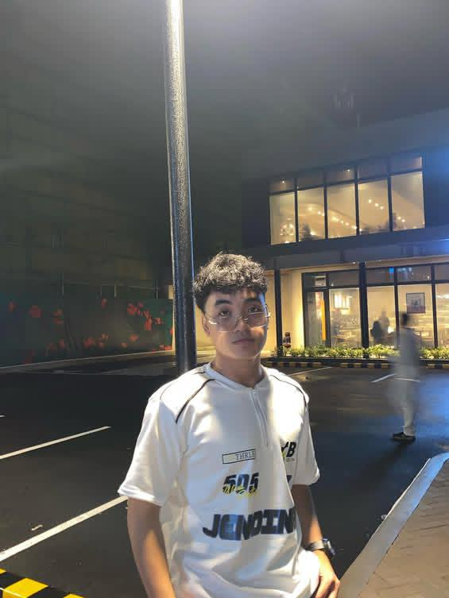

# 👋HELLO I'M JOHANN ASHTEEN R. OBIEN, STUDENT IN CCA.

## "WELCOME TO MY PORTFOLIO"
- I'm currently studying and learning to improve my skills in programming.

### 😎"About me"
- I'm 19 years old and currently a 2nd-year Computer Science student at CCA (City College of Angeles).
- My Birthdate is October 10 , 2005
- I live in Brgy. Paralaya, Porac, Pampanga.
- My hobbies are listening to music, gym cook, play online games, and dancing.
- My favorite dish is calderetang aso.

### 🏫"Educational Background"
- AMA Computer College (SHS) TVL- ICT S.Y 2021-2023
- Rafael Lszatin Memorial High School (JHS) S.Y 2017-2021
- Gueco Balibago Elementary School S.Y 2011-2016

### ☎️"Contact me"
- Email: jobien24-0130@cca.edu.ph)
- Social: FB: Johann Obien
- Contact #:09943712456
- ### My Project Links:
*  Midterm Paired Task 1: [My Project](https://docs.google.com/document/d/1UzJ6Q_VExp4yL5Fym-hRrcGXS5KBu6-3BJDTDaSqknc/edit?usp=sharing)
*  Midterm Lab Task 1: [My Project](https://docs.google.com/document/d/1oSJCCXoDwVpH78Gf67b_9XI4iesc54Azv6yxs7GtSJA/edit?usp=sharing)
* Midterm Lab Task 2: [My Project](https://docs.google.com/document/d/1suNSQKUkRtDd1yN3ML7fvMIk7df3tLCiWT23R2bjW20/edit?usp=sharing)
* Midterm Lab Task 3: [My Project](https://docs.google.com/document/d/1BGeVSMUz5JWHRVMoSnXWTzXm-OCHM2rWV9kxHt_2hI4/edit?usp=sharing)
* Midterm Lab Task 4: [My Project](https://docs.google.com/document/d/1haeFoaAIXcgcRhUotxyEGLX3TYhm33HB3hbJ4HcOv2w/edit?usp=sharing)
* Midterm Lab Task 5:[My Project](https://docs.google.com/document/d/1i1oXurrGvpIRdgubeJD2eHzgUXokuerKNTnVIWuAhuM/edit?usp=sharing)
* Midterm Lab Task 6: [My Project](https://docs.google.com/document/d/1C7TOFBZTK7ED0okmr1rCFXkmboSa9HCSUwYqIAbIkZA/edit?usp=sharing)
* Finals Lab Task 1:[My Project](https://docs.google.com/document/d/1XWg25ZfYgg1hjbpzAtHaFv_4C2659SAx2KQLtoWdIBE/edit?usp=drivesdk)
* Finals Task 2:[My Project](https://docs.google.com/document/d/1wOR3kD7HAk8a_edxepL7J0MFaQwOUgWUJbq_i35QSFI/edit?usp=drivesdk)
* Finals Task 3:[My Project](https://docs.google.com/document/d/19ewSbNIILZ14hx-NUOtHY3ylhrjUxlFKKncxy9Svuo8/edit?usp=drivesdk)
* PRACTICE DEMO task using Python GUI:[My Project](https://drive.google.com/file/d/1CcGszTJfFHK66wdBW6zTVMD5s5PYZ1ZB/view?usp=drivesdk)
* Finals task 4:[My Project](https://docs.google.com/document/d/1r4Q8RYs0Tmg9XwjDjGqdhXj5BDBpNVI6zTQ-qMjPE8g/edit?usp=drivesdk)
* Finals Task 5:[My Project](https://1drv.ms/w/c/D9C53216A44A12C3/EdguroYj3JNAure6xjP2-wkBQUhKVCEwDwws0hkUVPiFiw)
* Finals Lab Task 6:[My Project](https://docs.google.com/document/1QJ22uGOHUb3TgEySJjLsvwSIjBBZtJvek7dQlEkV8K4/edit?usp=drivesdk)

### "Thanks for visiting my profile"
